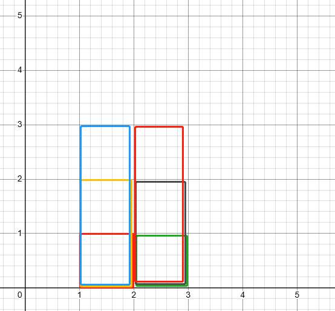

```
class Solution:
    def getSkyline(self, buildings: List[List[int]]) -> List[List[int]]:
        events = []
        for l, r, h in buildings:
            events.append((l, -h))
            events.append((r, h))
        events.sort()
        heap = [0]
        remove = defaultdict(int)
        res = []
        for x, h in events:
            if h < 0:
                heapq.heappush(heap, h)
            else:
                remove[-h] += 1
            
            while heap and heap[0] in remove:
                remove[heap[0]] -= 1
                if remove[heap[0]] == 0:
                    del remove[heap[0]]
                heapq.heappop(heap)

            # print(x, h, heap, remove)

            curHei = -heap[0]
            if not res or res[-1][1] != curHei:
                # print([x, curHei])
                res.append([x, curHei])
        return res

```

Why using set to lazy remove doesn't work? Set doesn't track how many times to remove a height value. There can be multiple heights with same value to remove.

Consider this test case. buildings =
[[1,2,1],[1,2,2],[1,2,3],[2,3,1],[2,3,2],[2,3,3]]
